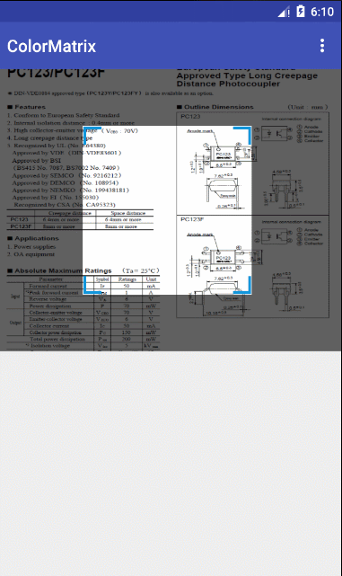

# android屏幕截图


使用：

xml引入

```
<com.infinite.capturelib.CaptureView
            android:id="@+id/shotView"
            app:frame_corner_border_length="20dp"
            app:frame_corner_border_width="2dp"
            app:frame_default_size="200dp"
            app:frame_min_size="100dp"
            app:frame_corner_color="#ff1296db"
            app:overlay_color="#9f000000"
            android:layout_width="match_parent"
            android:layout_height="match_parent" />
```
activity或者fragment中实例化，调用相应方法：

```
var target = shotView.shot(BitmapFactory.decodeResource(resources, R.mipmap.a))
                imgTarget.setImageBitmap(target)
```

参数解释：

| 名称 |类型|解释|
|-----|-----|-----|
|frame_corner_border_width|dimension|四个角的线宽度|
|frame_corner_border_length|dimension|四个角的线长度|
|frame_corner_color|color|四个角的颜色|
|frame_default_size|dimension|取图框默认大小|
|frame_min_size|dimension|取图框可以缩小的最小尺寸|
|overlay_color|color|遮罩层颜色|


效果：


